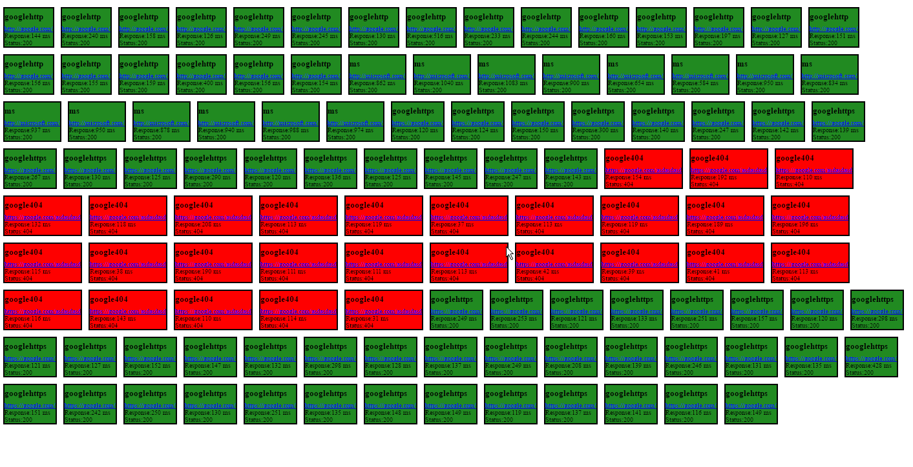

# Web Site Monitoring

WebMonitoring is a Windows service that provides a webpage (accessible at http://localhost:18080/) with the current status of the monitored URLs.

To install:
  - Download the latest release from the releases section
  - Unzip in some location
  - From an Administrator command prompt:
    - cd <location of the executable>
    - WebMonitoring.exe -install
         
To start it, either reboot the computer or just go to Services, find the WebMonService service, right-click, Start.
To remove it, stop the service and then from an Administrator command prompt:
  - cd <location of the executable>
  - WebMonitoring.exe -remove

To manage URLs, simply use the provided HTTP API with your favourite http client (any browser REST client should do just fine, or curl from the command line):
  - GET http://localhost:18080/sites - Retrieves all the registered URLs
  - POST http://localhost:18080/sites - Creates a new site to monitor
    - The body of the POST request is a json of the form: {"name": "somename","url":"http://example.com"}
  - GET http://localhost:18080/sites/<id> - Retrieves the Name and URL for the specified ID
  - DELETE http://localhost:18080/sites/<id> - Deletes the site and stops monitoring it
  - PUT http://localhost:18080/sites/<id> - Updates the information of that site, both the name and the url
    -  The body of the PUT request is a json of the form: {"name": "somename","url":"http://example.com"}

A small gif with how it looks like when monitoring a bunch of websites:

#### To Build

  - Build boost (http://www.boost.org/) on your system or download prebuilt binaries
  - git clone https://github.com/sa55231/WebMonitoring.git
  - cd WebMonitoring
  - Open WebMonitoring.sln with VS2015 (Community Edition is fine)
  - May need to adjust include directories and library directories to point to your boost installation
  - Compile.
 

 